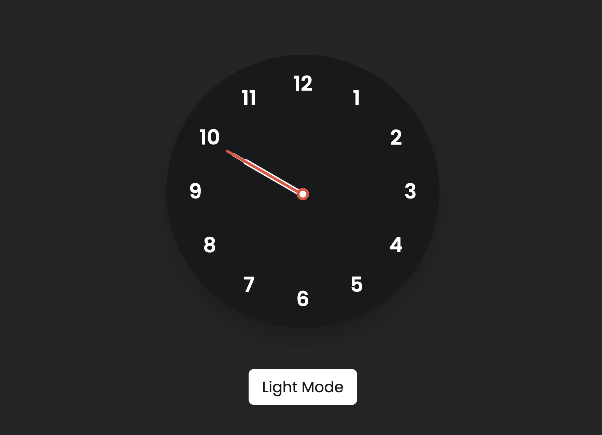

# analog-clock

This project is an analog clock implemented using HTML, CSS, and JavaScript. It includes a dark mode and light mode option for enhanced user experience. The analog clock provides a visually appealing way to display the current time.

## Contributing

Contributions to this project are welcome. If you find any issues or have suggestions for improvement, please feel free to open an issue or submit a pull request.

## License

This project is licensed under the MIT License. You are free to use, modify, and distribute this project for personal and commercial purposes.
